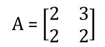
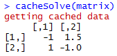
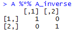

#Programming Assignment 2: Lexical Scoping
A detailed description of the functions can be found inside the comment sections of the script: **cachematrix.R**

###Getting started
1. Download the R Script: cachematrix.R
2. Load the script into R from your home directory using `source("cachematrix.R")` or if the script is not located in your home directory you can use `source("path_to_file/cachematrix.R")`.
3. Use the function `makeCacheMatrix` to create a cached matrix and use the function `cacheSolve` to calculate and cache the inverse of the matrix.

###Example
In this example we'll be using the matrix A:



To create matrix A using the `makeCacheMatrix` function use:

```r
matrix <- makeCacheMatrix(matrix(c(2,2,3,2), nrow = 2, ncol = 2))
A <- matrix$get()
A
```

*Output*

  | [,1] | [,2]
------------ | ------------- | -------------
**[1,]** | 2 | 3
**[2,]** | 2 | 2

Now to get the inverse of the matrix A we use:

```r
A_inverse <- cacheSolve(matrix)
A_inverse
```

*Output*

  | [,1] | [,2]
------------ | ------------- | -------------
**[1,]** | -1 | 1.5
**[2,]** | 1 | -1

To check if the result was indeed cached we can rerun `cacheSolve(matrix)` which will should now show the message *getting cached data*:



Finally using matrix multiplication, `A %*% A_inverse` should give the identity matrix I:


